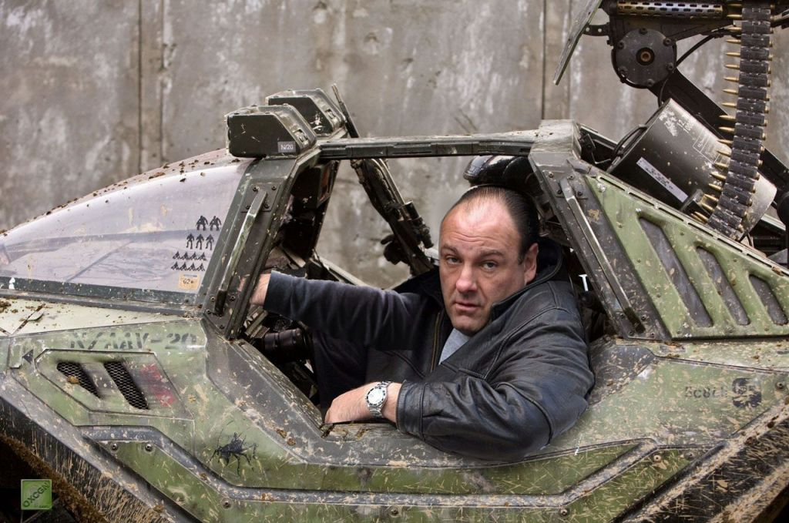

### Hi there 👋, I'm Cortona

- 👨‍🎓 I have two Bachelor's in Biology and Computer Science, and I'm now studying for my Master's in Computer Science.
- 💻 I'm coding my first rpg Kamui (Theres some gifs of the gameplay at the end)
- 🌱 I’m currently learning PyGame, Machine Learning, Tiled, Adobe Photoshop, and much more.
- 🎶 I love music, feel free to check out some of my favorite songs listed below.

- 🎵 Some of my favorite AMVS to vibe to when coding
    - [Blankz X One Piece](https://youtu.be/XyNDHDekIkU)
    - [FREDDIE DREDD X Attack On Titan](https://youtu.be/9AOmAa96Fb4)    
    - [Playboi Carti X Castlevania](https://youtu.be/x71ZfTqxaxQ)
    - [$uicideBoys X Naruto](https://youtu.be/qnTlTrA3T2A)

- 🎸 Some of my favorite rock songs to listen to are
    - [Alesana, The Thespian](https://youtu.be/8DOFsV0lxtQ)
    - [Blessthefall, Guys Like You Make Us Look Bad](https://youtu.be/KRDx2M9jXMA)
    - [Slipknot, Left Behind](https://youtu.be/D1jQKpse7Yw)
    - [Underaoth, Moving For The Sake Of Motion](https://youtu.be/iq596Y2Fa1E)

- ⚡ Favorite Shows: Attack on Titan, Castlevania, Death Note, JoJo's Bizarre Adventure, Naruto, One Punch, Sopranos, Sweet Home
- 🎥 Favorite Movies: Hereditary, Midsommar, Ouija: Origin of Evil, [REC], Sinister, The Ritual, The Texas Chainsaw Massacre

### Some gifs from my game (work in progress).
I'm writing the code, designing the maps, and drawing all the following (characters, monsters, physical/magic weapons) myself.

>>>>>>>
<!--
**Cortona1/Cortona1** is a ✨ _special_ ✨ repository because its `README.md` (this file) appears on your GitHub profile.

Here are some ideas to get you started:

- 🔭 I’m currently working on ...
- 🌱 I’m currently learning ...
- 👯 I’m looking to collaborate on ...
- 🤔 I’m looking for help with ...
- 💬 Ask me about ...
- 📫 How to reach me: ...
- 😄 Pronouns: ...
- ⚡ Fun fact: ...
-->
